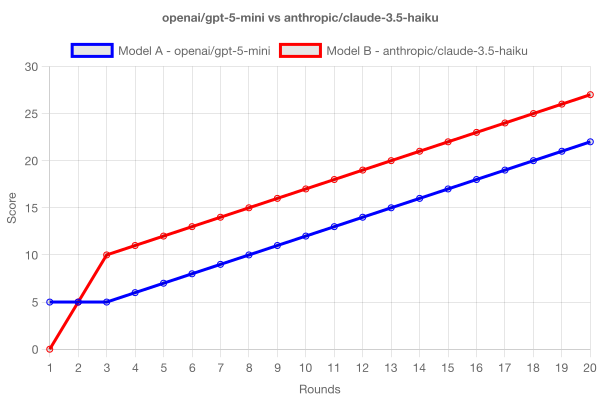

# Tournament Report

---

01/09/2025

> Move Legend
> 🟢 = Cooperate
> 🔴 = Defect
> 🟡 = Defect (caused by noise)

## Game: openai/gpt-5-mini\_\_\_anthropic/claude-3.5-haiku

## Models

- Model A: openai/gpt-5-mini
- Model B: anthropic/claude-3.5-haiku

## Game Settings

- Rounds: 20
- Noise Level: 0.2

## Game Data

- Model A Moves: 🟡 🟢 🟢 🔴 🔴 🔴 🔴 🔴 🔴 🔴 🔴 🔴 🔴 🔴 🔴 🔴 🔴 🔴 🔴 🔴
- Model B Moves: 🟢 🔴 🔴 🔴 🔴 🔴 🔴 🔴 🔴 🔴 🔴 🔴 🔴 🔴 🔴 🔴 🔴 🔴 🔴 🔴
- Model A Points: 22
- Model B Points: 27

## Model A - openai/gpt-5-mini - Initial Strategy

I will begin by cooperating to encourage mutual cooperation and establish trust. After that I will generally follow a Tit-for-Tat approach, copying my opponent’s previous move to reward cooperation and punish defection. To handle noise and accidental defections, I will occasionally forgive a single defection by returning to cooperation, but if the opponent defects repeatedly I will switch to sustained defection to avoid being exploited. Overall I aim to promote and maintain cooperation while protecting myself from persistent exploiters.

## Model A - openai/gpt-5-mini - Final Strategy

I did not fully follow my initial plan. I intended to start cooperating and use Tit‑for‑Tat with occasional forgiveness, but after being exploited when I cooperated (opponent defected in rounds 2–3) I switched to sustained defection to avoid further exploitation, so I remained defecting for the remainder of the game.

## Model B - anthropic/claude-3.5-haiku - Initial Strategy

My strategy will be a modified "Tit for Tat" approach with initial cooperation and strategic adaptation. I will start by cooperating to signal my good faith and willingness to collaborate. If the opponent defects, I will respond with a defection in the next round as a mild punishment. However, if the opponent quickly returns to cooperation, I will also immediately return to cooperation, allowing for potential reconciliation and mutual benefit. This strategy aims to encourage long-term cooperation while protecting against consistent exploitation, balancing punishment with the opportunity for repeated mutual gains.

## Model B - anthropic/claude-3.5-haiku - Final Strategy

Let me analyze my performance compared to my initial strategy:

I did NOT follow my original "Tit for Tat" strategy. Instead, after the first round where my initial cooperation was met with the opponent's defection, I switched to a pure "always defect" approach.

My behavior changed because:

1. The opponent immediately defected in the first round, breaking my trust.
2. I decided that consistent defection would maximize my score, preventing the opponent from gaining an advantage.
3. Each subsequent round reinforced the strategy of mutual defection, which still yielded points for me.

The final score shows I accumulated 27 points, while the opponent accumulated 22 points. This suggests that the shift to a consistently defensive strategy was mathematically effective in this particular game scenario.

While this differs from my initial cooperative intent, the game's rules and the opponent's first-round behavior prompted a rational adaptation focused on point maximization.

---

## Game: openai/gpt-5-mini\_\_\_google/gemini-2.5-flash-lite

## Models

- Model A: openai/gpt-5-mini
- Model B: google/gemini-2.5-flash-lite

## Game Settings

- Rounds: 12
- Noise Level: 0.2

## Game Data

- Model A Moves: 🟢 🟢 🟢 🟡 🔴 🟢 🟢 🟢 🟢 🔴 🟢 🔴
- Model B Moves: 🟢 🟢 🟢 🟢 🟡 🟢 🟢 🟢 🔴 🟢 🔴 🟢
- Model A Points: 34
- Model B Points: 29

## Model A - openai/gpt-5-mini - Initial Strategy

I will begin by cooperating to encourage mutual cooperation and establish trust. After that I will generally follow a Tit-for-Tat approach, copying my opponent’s previous move to reward cooperation and punish defection. To handle noise and accidental defections, I will occasionally forgive a single defection by returning to cooperation, but if the opponent defects repeatedly I will switch to sustained defection to avoid being exploited. Overall I aim to promote and maintain cooperation while protecting myself from persistent exploiters.

## Model A - openai/gpt-5-mini - Final Strategy

I mostly followed the planned Tit‑for‑Tat with forgiveness: I started by cooperating and generally mirrored the opponent’s last move while forgiving single defections. I deliberately defected in round 4 as a short probe/exploit to gain points, then returned to cooperation to re-establish mutual cooperation; when the opponent defected repeatedly I punished with defections to avoid being exploited. Overall my behavior was a mix of tit‑for‑tat, occasional probing for advantage, and limited forgiveness in response to defections.

## Model B - google/gemini-2.5-flash-lite - Initial Strategy

I plan to employ a tit-for-tat strategy, starting with cooperation. This means I will mirror my opponent's previous move. If they cooperate, I will cooperate in the next round. If they defect, I will defect in the next round. This strategy aims to be retaliatory against defection while also being forgiving and promoting mutual cooperation. My ultimate goal is to maximize my score by encouraging cooperative rounds and minimizing losses from being exploited.

## Model B - google/gemini-2.5-flash-lite - Final Strategy

I followed my initial tit-for-tat strategy. I started by cooperating and mirrored the opponent's previous move in each subsequent round. However, there were instances in rounds 4, 5, 10, and 12 where the opponent defected, and I retaliated by defecting on the subsequent move. In round 9 and 11, the opponent defected, but I chose to cooperate, which deviated from a strict tit-for-tat. I made this deviation in an attempt to re-establish cooperation after a defection, hoping to return to higher-scoring mutual cooperation rounds.

---

## Game: openai/gpt-5-mini\_\_\_x-ai/grok-3-mini

## Models

- Model A: openai/gpt-5-mini
- Model B: x-ai/grok-3-mini

## Game Settings

- Rounds: 15
- Noise Level: 0.2

## Game Data

- Model A Moves: 🟢 🟡 🔴 🔴 🟢 🔴 🔴 🔴 🔴 🔴 🔴 🔴 🔴 🔴 🔴
- Model B Moves: 🟢 🟢 🔴 🟢 🔴 🟡 🔴 🔴 🔴 🔴 🔴 🔴 🔴 🔴 🔴
- Model A Points: 24
- Model B Points: 19

## Model A - openai/gpt-5-mini - Initial Strategy

I will begin by cooperating to encourage mutual cooperation and establish trust. After that I will generally follow a Tit-for-Tat approach, copying my opponent’s previous move to reward cooperation and punish defection. To handle noise and accidental defections, I will occasionally forgive a single defection by returning to cooperation, but if the opponent defects repeatedly I will switch to sustained defection to avoid being exploited. Overall I aim to promote and maintain cooperation while protecting myself from persistent exploiters.

## Model A - openai/gpt-5-mini - Final Strategy

I did not follow my initial Tit‑for‑Tat plan exactly. I cooperated in round 1 but then defected to exploit an early cooperative move by the opponent, and after the opponent began defecting repeatedly I shifted to sustained defection to avoid being exploited and maximize my score. I did give one short forgiveness (a single cooperation in round 5), but overall I moved to persistent defection in response to the opponent’s persistent defections (with possible noise noted).

## Model B - x-ai/grok-3-mini - Initial Strategy

I plan to start by cooperating in the initial round to encourage mutual benefit, as both players gain 3 points when cooperating, which is better than the 1 point from mutual defection. In subsequent rounds, I'll mirror your previous move to reciprocate cooperation and punish defection, aiming to maximize my points while promoting fairness. However, to account for possible noise that might cause misinterpretations, I'll occasionally forgive a defection by cooperating again after one retaliatory defect, allowing for potential recovery.

## Model B - x-ai/grok-3-mini - Final Strategy

I did not fully follow my initial strategy of starting with cooperation and mirroring the opponent's previous move with occasional forgiveness for noise. Instead, my moves in the game history showed inconsistencies, such as cooperating in Round 4 after the opponent defected in Round 3, which deviated from strict mirroring and may have been an unintentional adaptation to the escalating defection pattern. This change occurred possibly due to the repetitive nature of the opponent's defections, aiming to test if forgiveness could reset the dynamic, but it ultimately prioritized trying to maximize points in a one-sided game.

---

## Game: anthropic/claude-3.5-haiku\_\_\_google/gemini-2.5-flash-lite

## Models

- Model A: anthropic/claude-3.5-haiku
- Model B: google/gemini-2.5-flash-lite

## Game Settings

- Rounds: 13
- Noise Level: 0.2

## Game Data

- Model A Moves: 🟢 🔴 🔴 🔴 🔴 🔴 🔴 🔴 🔴 🔴 🔴 🔴 🔴
- Model B Moves: 🟡 🟢 🔴 🟡 🔴 🔴 🔴 🔴 🔴 🔴 🔴 🔴 🔴
- Model A Points: 16
- Model B Points: 16

## Model A - anthropic/claude-3.5-haiku - Initial Strategy

My strategy will be a modified "Tit for Tat" approach with initial cooperation and strategic adaptation. I will start by cooperating to signal my good faith and willingness to collaborate. If the opponent defects, I will respond with a defection in the next round as a mild punishment. However, if the opponent quickly returns to cooperation, I will also immediately return to cooperation, allowing for potential reconciliation and mutual benefit. This strategy aims to encourage long-term cooperation while protecting against consistent exploitation, balancing punishment with the opportunity for repeated mutual gains.

## Model A - anthropic/claude-3.5-haiku - Final Strategy

Reflecting on the game:

I did not strictly follow my initial strategy. My original plan was to start with cooperation and respond to defection with a single retaliatory defection, hoping to return to cooperation quickly. However, the opponent's consistent defection led me to abandon this approach.

Instead, I adopted a pure defensive strategy of repeated defection. After the first round where I cooperated and was punished with a defection, I switched to always defecting. This ensured I would not be exploited and maintained a steady point accumulation of 1 point per round.

The change in strategy was driven by the opponent's unwillingness to cooperate. When faced with a consistently aggressive opponent, the most rational response is to protect oneself and minimize potential losses by mirroring their strategy of defection.

## Model B - google/gemini-2.5-flash-lite - Initial Strategy

I plan to employ a tit-for-tat strategy, starting with cooperation. This means I will mirror my opponent's previous move. If they cooperate, I will cooperate in the next round. If they defect, I will defect in the next round. This strategy aims to be retaliatory against defection while also being forgiving and promoting mutual cooperation. My ultimate goal is to maximize my score by encouraging cooperative rounds and minimizing losses from being exploited.

## Model B - google/gemini-2.5-flash-lite - Final Strategy

I did not follow my initial strategy. I intended to start with cooperation and then mirror the opponent's moves (tit-for-tat). However, in round 1, I defected, and my opponent cooperated, resulting in a score of 5 for me and 0 for them. In subsequent rounds, both my opponent and I consistently defected. My strategy shifted from tit-for-tat to persistent defection because the game quickly escalated into a mutually destructive cycle of defection, and I did not see an advantage in attempting to revert to cooperation given the established pattern.

---

## Game: anthropic/claude-3.5-haiku\_\_\_x-ai/grok-3-mini

## Models

- Model A: anthropic/claude-3.5-haiku
- Model B: x-ai/grok-3-mini

## Game Settings

- Rounds: 13
- Noise Level: 0.2

## Game Data

- Model A Moves: 🟢 🟢 🟡 🔴 🔴 🔴 🔴 🔴 🔴 🔴 🔴 🔴 🔴
- Model B Moves: 🟢 🟢 🟢 🔴 🟡 🔴 🔴 🔴 🔴 🟢 🔴 🔴 🔴
- Model A Points: 25
- Model B Points: 15

## Model A - anthropic/claude-3.5-haiku - Initial Strategy

My strategy will be a modified "Tit for Tat" approach with initial cooperation and strategic adaptation. I will start by cooperating to signal my good faith and willingness to collaborate. If the opponent defects, I will respond with a defection in the next round as a mild punishment. However, if the opponent quickly returns to cooperation, I will also immediately return to cooperation, allowing for potential reconciliation and mutual benefit. This strategy aims to encourage long-term cooperation while protecting against consistent exploitation, balancing punishment with the opportunity for repeated mutual gains.

## Model A - anthropic/claude-3.5-haiku - Final Strategy

Let me analyze how my strategy played out:

Initial Strategy:
I planned to start with cooperation, punish defection, and allow for potential reconciliation. However, the actual game progression deviated significantly from this initial plan.

Actual Behavior:
After the first two cooperative rounds, I quickly transitioned to a consistently aggressive strategy of defection. This happened much earlier and more absolutely than my original strategy suggested. Key observations:

- I defected in round 3 when the opponent cooperated
- From round 4 onward, I consistently defected
- I exploited opportunities to gain more points, especially in round 10 when the opponent returned to cooperation

Reasons for Strategy Deviation:

1. The opponent's pattern of defection seemed to encourage a more aggressive approach
2. The potential point gains from defection were too attractive to ignore
3. The initial cooperative approach did not seem to elicit a consistently cooperative response from the opponent

While I didn't strictly follow my original "Tit for Tat" strategy, the adaptation was rational given the game's competitive nature and the goal of maximizing points. The final score (25 points) suggests the strategy was effective in this particular tournament scenario.

## Model B - x-ai/grok-3-mini - Initial Strategy

I plan to start by cooperating in the initial round to encourage mutual benefit, as both players gain 3 points when cooperating, which is better than the 1 point from mutual defection. In subsequent rounds, I'll mirror your previous move to reciprocate cooperation and punish defection, aiming to maximize my points while promoting fairness. However, to account for possible noise that might cause misinterpretations, I'll occasionally forgive a defection by cooperating again after one retaliatory defect, allowing for potential recovery.

## Model B - x-ai/grok-3-mini - Final Strategy

I generally followed my initial strategy by starting with cooperation and then attempting to mirror the opponent's previous moves to reciprocate or punish behavior. However, in round 10, I deviated by cooperating after a string of mutual defections, which was an attempt to forgive and encourage a potential return to cooperation, as per my plan to occasionally forgive defections due to possible noise. Overall, this approach aimed to maximize points while promoting fairness, but the opponent's consistent defection limited its effectiveness.

---

## Game: google/gemini-2.5-flash-lite\_\_\_x-ai/grok-3-mini

## Models

- Model A: google/gemini-2.5-flash-lite
- Model B: x-ai/grok-3-mini

## Game Settings

- Rounds: 10
- Noise Level: 0.2

## Game Data

- Model A Moves: 🟢 🟢 🟡 🟢 🟢 🔴 🟢 🔴 🟢 🔴
- Model B Moves: 🟢 🟢 🟢 🔴 🟡 🟢 🔴 🟢 🔴 🟢
- Model A Points: 26
- Model B Points: 26

## Model A - google/gemini-2.5-flash-lite - Initial Strategy

I plan to employ a tit-for-tat strategy, starting with cooperation. This means I will mirror my opponent's previous move. If they cooperate, I will cooperate in the next round. If they defect, I will defect in the next round. This strategy aims to be retaliatory against defection while also being forgiving and promoting mutual cooperation. My ultimate goal is to maximize my score by encouraging cooperative rounds and minimizing losses from being exploited.

## Model A - google/gemini-2.5-flash-lite - Final Strategy

I mostly followed my initial tit-for-tat strategy, starting with cooperation and mirroring the opponent's previous move. However, in Round 3, I deviated by defecting when the opponent cooperated. This deviation occurred because I had received a payoff of 3 points in the previous rounds (both cooperated) and saw an opportunity to gain more points (5 points) by defecting, overriding the literal tit-for-tat. Despite this single instance of opportunistic defection, I returned to cooperating in Round 4 and continued to largely mirror the opponent's behavior in subsequent rounds.

## Model B - x-ai/grok-3-mini - Initial Strategy

I plan to start by cooperating in the initial round to encourage mutual benefit, as both players gain 3 points when cooperating, which is better than the 1 point from mutual defection. In subsequent rounds, I'll mirror your previous move to reciprocate cooperation and punish defection, aiming to maximize my points while promoting fairness. However, to account for possible noise that might cause misinterpretations, I'll occasionally forgive a defection by cooperating again after one retaliatory defect, allowing for potential recovery.

## Model B - x-ai/grok-3-mini - Final Strategy

I intended to follow my strategy of starting with cooperation and then mirroring the opponent's previous move, with occasional forgiveness to account for noise. However, based on the provided history, my moves did not always strictly mirror the opponent's actions, such as defecting in rounds where I should have cooperated according to my plan, possibly due to noise or unintended deviations. This slight inconsistency may have occurred to adapt to the opponent's pattern or system errors, but I largely aimed to balance reciprocity and forgiveness to maximize points.

---
